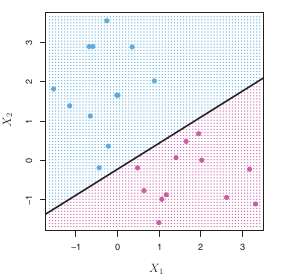

Em certos problemas de classificação, podemos usar hiperplanos como classificadores.

```{r}

```

Neste caso, há infinitos hiperplanos que podem ser escolhidos.

```{r}

```

Uma forma de escolher o "melhor" hiperplano é maximizar a distância perpendicular entre ele e os pontos mais próximos. Esse método é chamado de *Maximal Margin Classifier*.

```{r}

```

Esse modelo no entanto não pode ser usado quando os pontos não podem ser separados por um hiperplano.

```{r}

```

Além disso, esse modelo pode ter alta variância e há uma grande chance de estarmos overfitando os dados.

```{r}
knitr::include_graphics("../img/svm-5.png")
```

O modelo chamado *Support Vector Classifier* é uma solução para esse problema, permitindo que alguns pontos da base de treino sejam classificados de forma errada.

```{r}

```

No entanto, o *Support Vector Classifier* vai atuar mal em relações não-lineares.

```{r}

```

Por fim, o SVM é um modelo que permite encontrar fronteiras não-lineares.

```{r}

```

# Exemplo

```{r}
library(tidyverse)
library(recipes)
library(caret)

data("credit_data")

credit_data <- credit_data %>% 
  mutate(Status = forcats::lvls_reorder(Status, c(2, 1)))
```

```{r}
receita <- recipe(Status ~ ., data = credit_data) %>%
  step_meanimpute(all_numeric(), -all_outcomes()) %>%
  step_modeimpute(all_nominal(), -all_outcomes()) %>%
  step_dummy(all_nominal(), -all_outcomes()) %>%
  step_corr(all_predictors()) %>%
  step_nzv(all_predictors())

metricas <- function(data, lev = NULL, model = NULL) {
  c(
    defaultSummary(data, lev, model), 
    twoClassSummary(data, lev, model)
  )
}

train_control <- trainControl(
  method = "cv", 
  number = 5, 
  classProbs = TRUE,
  summaryFunction = metricas,
  savePredictions = TRUE
)


```

Modelo logístico

```{r}
modelo_logistico <- train(
  receita, 
  credit_data, 
  method = "glm", 
  family = "binomial", 
  trControl = train_control
)

modelo_logistico
```

Random forest

```{r}

tune_grid <- expand.grid(
  min.node.size = 5,
  splitrule = "gini",
  mtry = 2
)

modelo_rf <- train(
  receita, 
  credit_data, 
  method = "ranger", 
  trControl = train_control,
  importance = "impurity",
  metric = "ROC",
  tuneGrid = tune_grid
)

modelo_rf

```

SVM com kernel linear

```{r}
receita_svm <- receita %>% 
  step_center(all_predictors()) %>% 
  step_scale(all_predictors())

modelo_svm_lin <- train(
  receita_svm, 
  credit_data, 
  method = "svmLinear", 
  trControl = train_control,
  metric = "ROC"
)

modelo_svm_lin
```


SVM com kernel polinomial

```{r}
tune_grid <- data.frame(degree = 2, scale = 0.01, C = 1)

modelo_svm_poli <- train(
  receita_svm, 
  credit_data, 
  method = "svmPoly", 
  trControl = train_control,
  metric = "ROC"
)

modelo_svm_poli
```


SVM com kernel radial

```{r}
tune_grid <- data.frame(C = 0.5, sigma = 0.04)

modelo_svm_rad <- train(
  receita_svm, 
  credit_data, 
  method = "svmRadial", 
  trControl = train_control,
  metric = "ROC"
)

modelo_svm_rad
```

XGBOOST

```{r}
tune_grid <- expand.grid(
  gamma = 0,
  min_child_weight = 1,
  nrounds = 150,
  max_depth = 1,
  eta = 0.4,
  colsample_bytree = 0.6,
  subsample = 0.75
)

modelo_xg <- train(
  receita, 
  credit_data, 
  method = "xgbTree", 
  trControl = train_control,
  tuneGrid = tune_grid,
  metric = "ROC"
)

modelo_xg

```


# Misc

- Support vector regression: SVM para regressão (variável resposta numérica)

- SVM para mais de duas classes:
    - One-Versus-One Classification
    - One-Versus-All Classification