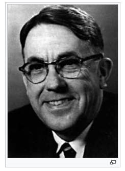
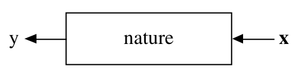

```{r setup, include=FALSE}
options(htmltools.dir.version = FALSE)
```

# Programa do curso

-  **Introdução ao Machine Learning e ambientação ao R e RStudio**

-  **Estratégias gerais: separação da base de dados, reamostragem, tuning de modelos, métricas de performance**

- **Regressão linear, regularização**

- **Regressão logística, regressão vs classificação**

- **Modelos de árvores**

- **Bagging e Boosting**

- **Cases**

---

# Ciência de dados


---

class: middle, center, inverse

# Introdução

---

# O que é Machine Learning?

<br>

--

- Não é um termo novo: criado por Arthur Samuel, em 1959



--

- Existe um grande hype atualmente em cima desse termo (~50 artigos por dia no Arxiv!!!)

--

- Machine Learning é um nome marketeiro para modelagem preditiva

--

- Modelagem preditiva é um framework de análise de dados que visa gerar a estimativa mais precisa possível para uma quantidade ou fenômeno (Max Kuhn, 2014).


---

# Por que o hype?

- Poderio computacional

- Disponibilidade de dados

- Sucesso em resolver problemas historicamente difíceis

---

## Exemplos


--


--


--


--


--


--


---

class: middle, center

# Relação com a Estatística

Leo Breiman: ["Statistical Modeling: The Two Cultures"](https://projecteuclid.org/euclid.ss/1009213726)


---

# Machine Learning e Estatística



--

1) Gostaríamos de saber como $x$ e $y$ estão relacionadas.

--

2) Gostaríamos de prever $y$ a partir de $x$.

--

<br>

Matematicamente, queremos encontrar uma função $f()$ tal que:

$$
y \approx f(x)
$$

---

# Machine Learning e Estatística

  
 
--

<br>
<br>
 
 

---

class: middle, center, inverse

# Habilidades

---

# Pensamento crítico

<br>
<br>
<br>

- Entender o problema

- Manter foco no objetivo

- Definir a métrica


---

# Entender o problema


---

# Entender o objetivo


---

# Definir a métrica


---

</img>


---
class: middle, center, inverse

# Estratégias

---

# Vamos falar de

- Intuição

- Viés e variância

- Erro de treino e erro de teste

- Validação cruzada

---

# Definições


```{r echo=FALSE, include=FALSE}
knitr::opts_chunk$set(
  echo = FALSE, 
  message = FALSE, 
  warning = FALSE,
  fig.width=6, 
  fig.height=6,
  fig.align='center'
)
library(tidyverse)
adv <- read_csv("data/Advertising.csv")
```

Somos consultores e fomos contratados para dar conselhos para uma empresa aumentar as suas vendas.

--

Obtivemos o seguinte banco de dados

```{r, fig.width = 10, fig.height = 4}
adv %>% 
  gather(midia, investimento, -sales) %>% 
  ggplot(aes(x = investimento, y = sales)) + 
  geom_point() +
  facet_wrap(~midia, scales = "free")
```

* O propritário não consegue interferir diretamente nas vendas, mas consegue interferir no investimento em propaganda. 

---

# Definições

* __X1__: budget para propagandas em jornal
* __X2__: budget para propagandas em radio
* __X3__: budget para propagandas em TV

* __Y__: qtd vendida

--

* __X1, X2 e X3__ são as variáveis explicativas ou independentes ou *features* ou variáveis preditoras. Também chamamos de variáveis.

* Y é a variável resposta ou variável dependente. 

---

# Intuição

$$Y = f(X) + \epsilon$$

* $X = (X_1, X_2, ..., X_n)$
* $\epsilon$ é um termo de erro aleatório com média zero.

--

Uma outra forma de representar isso é escrever

$$Y \approx f(X)$$

--

Machine Learning se refere a um conjunto de técnicas para estimar $f$. 

--

Vamos falar dos pricipais conceitos teóricos que surgem ao estimarmos $f$ e de formas para avaliar as estimativas obtidas.

---

# Por que estimar $f$?

--
* Predição
--

* Inferência

--

## Predição

Em muitas situações X está disponível facilmente mas, Y não é fácil de descobrir. (Ou mesmo não é possível descobrí-lo).

$$\hat{Y} = \hat{f}(X)$$
é uma boa estimativa.
Neste caso não estamos interessados em como é a estimativa $\hat{f}$ desde que ela apresente predições boas para $Y$.

---

## Predição

A acurácia de uma estimativa $\hat{Y}$ pode ser dividade em duas quantidades:

* erro redutível
* erro irredutível


* Essa parte irredutível, significa não redutível pela escolha do modelo/algoritmo. Ela pode ser reduzida se forem coletadas outras variáveis, mais dados, etc. Qualquer coisa que possa fazer a variância de $\epsilon$ diminuir.

---

## Inferência

Em inferência estamos mais interessados em entender a relação entre as variáveis explciativas $X$ e a variável resposta $Y$.

Alguns exemplos:

* Quais são as variáveis que estão mais relacionadas com a respostas?
* Qual a relação entre a resposta e cada um dos preditores?
* A relação entre $y$ e $X$ pode ser resumida por um modelo linear ou a relação é mais complexa?

--

Neste curso, vamos principalmente sobre **predição**.

---

# Como estimamos $f$?

Para estimar $f$, coletamos um conjunto de pares $(X, Y)$ e usamos algum algoritmo para encontrar uma $f$ tal que $Y \approx f(X)$.

Os modelos estão basicamnte dividios em duas classes:

* Paramétricos
* Não paramétricos

---

## Paramétricos

Assumem uma forma funcional para $f$ e depois estimam parâmetros. 

--

Podemos assumir que $f$ possui a forma funcional linear:

$$f(X) = \beta_1*X_1 + \beta_2*X_2 + ... + \beta_p*X_p$$

E depois ajustamos/treinamos essa forma funcional para encontrar $\beta_1, \beta_2, ..., \beta_p$ tal que:

$$Y \approx \beta_1*X_1 + \beta_2*X_2 + ... + \beta_p*X_p$$
---

## Paramétricos

Chamamos de paramétricos pois reduzimos o problema de estimar $f$ para o problema de estimar um conjunto de parâmetros $\beta$.

Desvantagens:

--

* geralmente a forma funcional que escolhemos para $f$ não é a forma forma funcional da verdadeira $f$.
* podemos aumentar o número de parâmetros, mas em geral isso leva ao overfitting.

--

Vantagens:

--

* em geral é computacionalmente mais eficiente
* em geral precisa de menos observações


---

## Não-paramétricos

Não fazem suposições explícitas sobre a forma funcional de $f$. Estimam uma $f$ que fica o mais próximo possível dos pontos de treino sem ser muito rigoroso e nem muito flexível.


---

## Não paramétricos

**Vantagens**

* A principal vantagem sobre os modelos paramétricos é que por não fazerem suposiçõe sobre a forma de $f$ podem se ajustar bem á diversas formas possíveis de $f$. 

**Desvantagens**

* Em geral precisa de mais observações para ficar bom.
* Pode ser mais custoso computacionalmente

---

# Flexibilidade ou Intertabilidade?


---

# Regressão e Classificação

Existem dois principais tipos de problemas em Machine Learning:

* Regressão
* Classificação

---

# Estimando a performance

Para problemas de regressão:

* $R^2$
* Raíz do erro quadrático médio (RMSE)

$$RMSE = \frac{1}{n}\sum_{i=1}^n \big(y_i - \hat{f}(x_i)\big)^2$$

---

# Estimando a performance

Para problemas de classificação:

* Acurácia
* Kappa

$$Kappa = \frac{acurácia - p}{1 - p}$$
Onde $p$ é a taxa de resposta.

---

# Estimando a performance

* Área sobre a curva ROC.
* KS
* Sensibilidade: Taxa de verdadeiros positivos.
* Especificidade: Taxa de verdadeiros negativos. 


---

# Estimando a performance

Essas medidas podem ser calculadas na base de dados que usamos para ajustar o modelo. 
No entanto, não estamos muito interessados no valor delas dentro da base de *treino*. 

> Estamos interessados nas métricas de erro/acerto para observações que não foram vistas durante o treino.

* **Exemplo**: Se fazemos um modelo para prever o valor de ações no mercado. Não estamos interessados no quanto acertamos para os últimos 6 meses. Estamos interessados em acertar o valor da ação amanhã, ou no próximo mês.

---

# Estimando a performance

Considere que treinamos um modelo com o banco de dados:

$${(x_1, y_1), (x_2, y_2), ... ,(x_x, y_n)}$$

Portanto temos uma $\hat{f}$ tal que $y_1 \approx \hat{f}(x_1)$, $y_2 \approx \hat{f}(x_2)$, ...
Portanto poderíamos calcular o MSE do treino, fazendo:

$$MSE = \sum_{i = 1}^{n} (y_i - \hat{f}(x_i))^2$$
No entanto, não estamos interessados nessa medida. Em teoria estamos interessados em:

$$MSE = Média((y_0 - \hat{f}(x_0))^2)$$
Em que ( $x_0 , y_0$) é uma observação nova. (Não conhecida pelo modelo).

---

# Como estimamos o MSE para novas observações?

Podemos separar uma parte da base de dados que não será conhecida para o modelo no momento do ajuste.

---

# Exemplo no R

---

# Estimando a performance do modelo

- **Erro de treino**: é o erro encontrado ao aplicar o modelo na própria base utilizada para treiná-lo.

- **Erro de teste**: é o erro encontrado ao aplicar o modelo a uma base não utilizada no treino.

---

# Separação da base

- **base de treino**: observações utilizadas para estimar os parâmetros do modelo e determinar os parâmetros de complexidade (hiperparâmetros)

- **base de teste**: observações utilizadas para estimar o erro de teste. Essas observações não devem ser usadas para treinar o modelo.

--

- Muitas observações na base de treino vão levar a estimativas mais precisas para os parâmetros, mas não teremos uma boa estimativa da performance do modelo.

- Muitas observações na base de teste não vão permitir termos boas estimativas dos parâmetros.

---

# Viés e variância


---

# Selecionando hiperparâmetros

E como fazemos para determinar os parâmetros de complexidade?

--

**Validação cruzada**: método para estimar o erro preditivo de um modelo utilizando reamostragem.

--

- Leave-one-out cross-validation (LOOCV)
- K-fold cross-validation

---

# LOOCV

```{r}
knitr::include_graphics("img/loocv.png")
```

---

# k-fold

```{r}
knitr::include_graphics("img/k-fold-cv.png")
```

---

# Atenção especial quando o tempo está envolvido.


