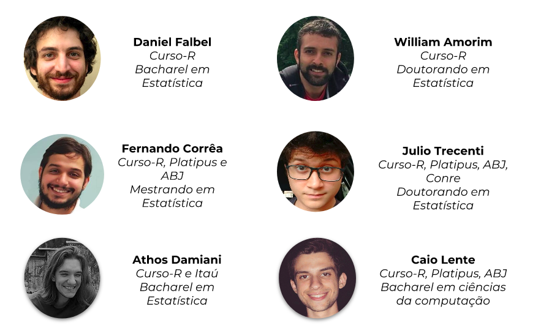
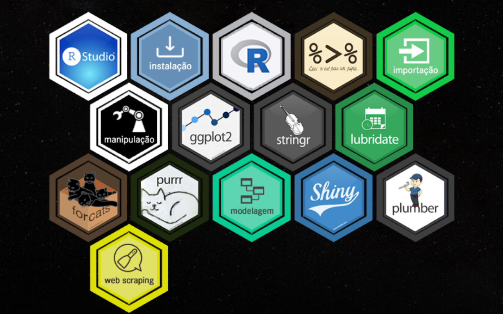
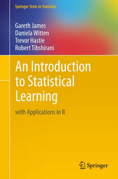
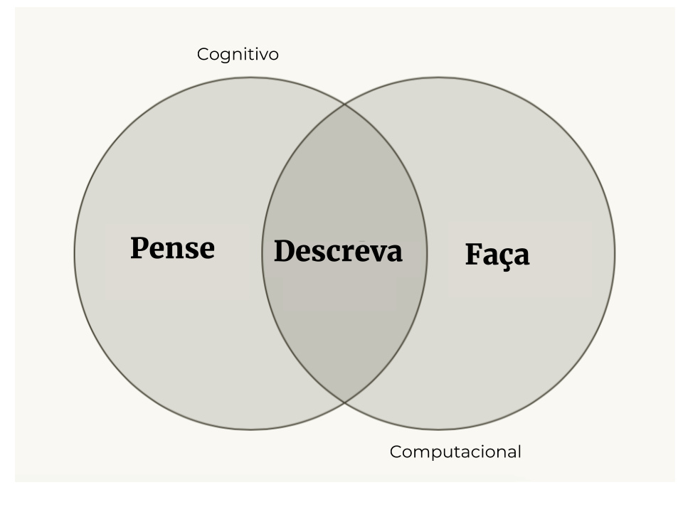

class: middle, center

# Sobre a Curso-R

---

## Curso-R

</img>

---

## Curso-R

<br>

- Primeiros cursos em 2015, no IME-USP

- Curso-R surge oficialmente em 2017

- Mais de 20 cursos e 300 alunos

---
class: middle, center

# Sobre o curso

---
## Cronograma

- Introdução à programação em R
   - Conceitos básicos e importação (03/12)
   - Manipulação de dados (05/12)
   - Visualização de dados (07/12)
   - Case, dashboards estáticos e outros tópicos (10/12)
   
- Introdução ao Machine Learning com R
  - Principais conceitos e estratégias (12/12)
  - Regressão linear e regressão logística (14/12)
  - Modelos de árvores, Bagging e Boosting (17/12)
  - Aprendizado não-supervisionado, SVM, Market Basket Analysis, Otimização (19/12)

- Introdução ao Deep learning (janeiro)
  - Principais conceitos
  - Embeddings
  - Redes neurais convolucionais e redes neurais recorrentes

---

## Material

- Temos um material em português disponível nesta página:

<center><a href = 'http://material.curso-r.com/'>http://material.curso-r.com/ </a></center>

</img>

- Também temos um blog: <a href='http://curso-r.com/blog/'>http://curso-r.com/blog/ </a>

---

## Referências

- [R for data science](https://r4ds.had.co.nz)

- [Introduction to statistical learning](https://www-bcf.usc.edu/~gareth/ISL/ISLR%20Seventh%20Printing.pdf)

<br>

.pull-left[

]

.pull-right[

]

---

class: middle, center

# Introdução: por que programar?

---
## Fazemos análise de dados no computador

 

---
class: center, middle

### Por que programar é preferível?

<br>

# 1. Código é texto
# 2. Código é legível
# 3. Código é aberto

---
class: middle, center

# Código é texto

Podemos copiar e colar


---
class: middle, center

### Stack Overflow


---
## Código é legível

```{r message=FALSE, warning=FALSE, include=FALSE}
library(magrittr)
library(magick)
library(ggplot2)
library(dplyr)
library(viridis)
```

```{r, eval = FALSE}
image_read("https://jeroen.github.io/images/frink.png") %>%
  image_rotate(270) %>%
  image_background("blue", flatten = TRUE) %>%
  image_border("red", "10x10") %>%
  image_annotate("Liguagens de programação ainda\nsão linguagens!", 
                 color = "white", size = 30)
```

--

.pull-left[

]

--

.pull-right[
```{r, eval = TRUE, echo = FALSE}
image_read("https://jeroen.github.io/images/frink.png") %>%
  image_rotate(270) %>%
  image_background("blue", flatten = TRUE) %>%
  image_border("red", "10x10") %>%
  image_annotate("Liguagens de programação ainda\nsão linguagens!", 
                 color = "white", size = 30)
```
]


---
# Código é aberto

Todas as linguagens de programação modernas são open-source:


- Estudantes podem usar as mesmas ferramentas que os profissionais.

- Todos podem usar as melhores ferramentas independente do poder financeiro.

- Qualquer um pode reproduzir as suas análises.

- Você pode corrigir problemas.

- Você pode desenvolver suas próprias ferramentas.

---
class: middle, center

### Por que utilizar o R?

--

# O R foi criado para fazer análise de dados.

---

## O ciclo da ciência de dados


---

## O ciclo da ciência de dados com o R


---

## Por que usar o R?


O R é a **cola**.

---
class: middle, center

# Ambientação

---
class: center, middle, inverse

```{r setup2, include=FALSE}
options(htmltools.dir.version = FALSE)
```

## Download do R

[Windows](https://cran.r-project.org/bin/windows/base/)
[MacOS](https://cran.r-project.org/bin/macosx/)
[Linux](https://www.digitalocean.com/community/tutorials/how-to-install-r-on-ubuntu-16-04-2)

---
class: center, middle, inverse

## Download do RStudio

[Todas as plataformas](https://www.rstudio.com/products/rstudio/download/#download)


---
# Vamos ao R!

<br>


